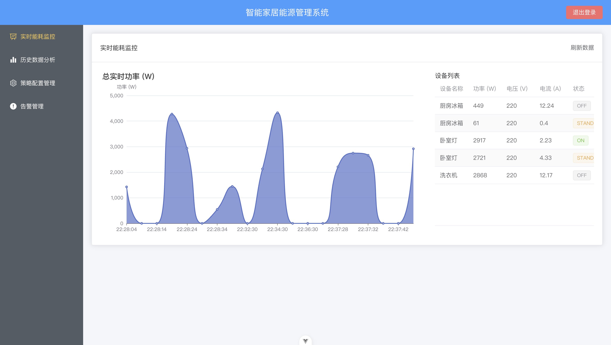

# 项目配置文档 - 智能家居能源管理系统前端

`update by Zhexi Luo`

**版本：** 1.0.0
**最后更新时间：** 2025年5月31日



## 目录

1. [项目概述](https://www.google.com/search?q=%231-%E9%A1%B9%E7%9B%AE%E6%A6%82%E8%BF%B0&authuser=1)
2. [环境要求](https://www.google.com/search?q=%232-%E7%8E%AF%E5%A2%83%E8%A6%81%E6%B1%82&authuser=1)
3. [项目结构](https://www.google.com/search?q=%233-%E9%A1%B9%E7%9B%AE%E7%BB%93%E6%9E%84&authuser=1)
4. [安装与依赖](https://www.google.com/search?q=%234-%E5%AE%89%E8%A3%85%E4%B8%8E%E4%BE%9D%E8%B5%96&authuser=1)
5. [开发服务器配置](https://www.google.com/search?q=%235-%E5%BC%80%E5%8F%91%E6%9C%8D%E5%8A%A1%E5%99%A8%E9%85%8D%E7%BD%AE&authuser=1)
6. [构建与部署](https://www.google.com/search?q=%236-%E6%9E%84%E5%BB%BA%E4%B8%8E%E9%83%A8%E7%BD%B2&authuser=1)
7. [路由配置 (`src/router/index.js`)](https://www.google.com/search?q=%237-%E8%B7%AF%E7%94%B1%E9%85%8D%E7%BD%AE-srcrouterindexjs&authuser=1)
8. [API 与 Mock 服务配置](https://www.google.com/search?q=%238-api-%E4%B8%8E-mock-%E6%9C%8D%E5%8A%A1%E9%85%8D%E7%BD%AE&authuser=1)
9. [代码规范与格式化](https://www.google.com/search?q=%239-%E4%BB%A3%E7%A0%81%E8%A7%84%E8%8C%83%E4%B8%8E%E6%A0%BC%E5%BC%8F%E5%8C%96&authuser=1)
10. [UI 组件库 (Element Plus)](https://www.google.com/search?q=%2310-ui-%E7%BB%84%E4%BB%B6%E5%BA%93-element-plus&authuser=1)
11. [图表库 (ECharts)](https://www.google.com/search?q=%2311-%E5%9B%BE%E8%A1%A8%E5%BA%93-echarts&authuser=1)
12. [其他配置](https://www.google.com/search?q=%2312-%E5%85%B6%E4%BB%96%E9%85%8D%E7%BD%AE&authuser=1)

---

## 1. 项目概述

本项目是智能家居能源管理系统的前端应用，基于 Vue 3 和 Vite 构建，使用 Element Plus 作为 UI 组件库，ECharts 进行数据可视化，并通过 Axios 与后端 API（开发阶段使用 **Mock.js 模拟）进行交互。**

## 2. 环境要求

**Node.js:** 推荐 LTS 版本 (例如 18.x 或 20.x)。

* **包管理器:** npm (v6+)
* **代码编辑器:** Vscode

## 3. 项目结构

项目采用 Vite + `create-vue` 生成的标准目录结构：

```
smart-energy-system-frontend/
├── public/                  # 静态资源
├── src/                     # 源代码目录
│   ├── assets/              # 模块静态资源 (CSS, 图片等)
│   ├── components/          # 可复用 Vue 组件
│   ├── router/              # Vue Router 配置
│   ├── services/            # API 服务及 Mock 服务
│   ├── views/               # 页面级 Vue 组件
│   ├── App.vue              # 根 Vue 组件
│   └── main.js              # 应用入口文件
├── .eslintrc.cjs            # ESLint 配置文件
├── .gitignore
├── .prettierrc.json         # Prettier 配置文件
├── index.html               # SPA 主 HTML 入口
├── package.json             # 项目依赖和脚本
├── README.md
├── tsconfig.json            # TypeScript 配置文件 (如果启用)
└── vite.config.js           # Vite 配置文件
```

## 4. 安装与依赖

1. git clone <项目url>
2. 进入项目根目录：`cd smart-energy-system-frontend`
3. 安装项目依赖：
   **Bash**

   ```
   npm install
   ```

   主要依赖项记录在 `package.json` 中，包括 `vue`, `vue-router`, `element-plus`, `axios`, `echarts`, `mockjs` 等。

## 5. 开发服务器配置

### 启动命令

在项目根目录运行以下命令启动本地开发服务器：

**Bash**

```
npm run dev
```

默认情况下，开发服务器会运行在 `http://localhost:5173`

### Vite 配置文件 (`vite.config.js`)

**后续连接后端调用api时，需要修改Vite.config.js**

此文件用于配置 Vite 的行为，包括插件、开发服务器选项、构建选项等。

**示例配置 (代理 API 请求):**

**JavaScript**

```
// vite.config.js
import { defineConfig } from 'vite'
import vue from '@vitejs/plugin-vue'

export default defineConfig({
  plugins: [vue()],
  server: {
    port: 5173, // 可选：指定开发服务器端口
    proxy: {
      // 将 /api 开头的请求代理到后端服务器 (替换 target 为实际后端地址)
      // 在不使用 Mock.js 或需要连接真实后端时启用
      '/api': {
        target: 'http://your-actual-backend-api.com',
        changeOrigin: true,
        // rewrite: (path) => path.replace(/^\/api/, '') // 如果后端 API 路径不包含 /api 前缀
      }
    }
  },
  resolve: {
    alias: {
      '@': '/src' // 配置 @ 指向 src 目录
    }
  }
})
```

### 环境变量

Vite 支持通过 `.env` 文件加载环境变量。

* `.env`: 所有模式下都加载。
* `.env.local`: 所有模式下都加载，但会被 git 忽略。
* `.env.[mode]`: 只在指定模式下加载 (例如 `.env.development`)。
* `.env.[mode].local`: 只在指定模式下加载，但会被 git 忽略。

在应用代码中通过 `import.meta.env.VITE_YOUR_VARIABLE_NAME` 访问以 `VITE_` 开头的环境变量。

例如，在 `.env.development` 中控制是否启用 Mock API：

```
VITE_USE_MOCK_API=true
```

在 `src/main.js` 中使用：

**JavaScript**

```
if (import.meta.env.VITE_USE_MOCK_API === 'true') {
  await import('./services/mockApi.js');
}
```

## 6. 构建与部署

### 构建命令

在项目根目录运行以下命令将项目打包为生产环境的静态文件：

**Bash**

```
npm run build
# 或者
# yarn build
# 或者
# pnpm build
```

### 输出目录

构建产物默认会输出到项目根目录下的 `dist/` 文件夹。此文件夹包含 `index.html` 以及经过编译和优化的 JavaScript、CSS 和其他静态资源，可以直接部署到静态文件服务器。

## 7. 路由配置 (`src/router/index.js`)

* 使用 `vue-router` 进行单页面应用的路由管理。
* 采用 **Hash 模式** (`createWebHashHistory`) 或 **History 模式** (`createWebHistory`)。当前配置为 Hash 模式，可根据部署环境调整。
* 路由懒加载 (`component: () => import(...)`) 用于优化初始加载性能。
* 全局前置导航守卫 (`router.beforeEach`) 用于实现登录认证和路由权限控制。

## 8. API 与 Mock 服务配置

### API 客户端 (`src/services/api.js`)

* 使用 `axios` 创建 API 请求客户端实例。
* 配置了 `baseURL` (默认为 `/api`，方便代理或 Mock.js 拦截)。
* 配置了请求拦截器，自动在请求头中添加 `Authorization` Token (从 `localStorage` 获取)。
* 导出一个 `api` 对象，封装了所有与后端交互的函数。

### Mock API (`src/services/mockApi.js`)

* 使用 `mockjs` 拦截 AJAX 请求并返回模拟数据，用于前端独立开发和测试。
* 在 `src/main.js` 中，通过环境变量 `import.meta.env.DEV` (或自定义的 `VITE_USE_MOCK_API`) 控制是否在开发环境下加载并启用 Mock 服务。
* Mock 规则定义了各个 API 端点的预期请求和响应结构。

## 9. 代码规范与格式化

### ESLint

* 配置文件：`.eslintrc.cjs`
* 用于静态代码分析，检查代码风格和潜在错误。
* 通常与 Vue 官方的 ESLint 插件 (`eslint-plugin-vue`) 配合使用。
* 可以通过 `npm run lint` (需在 `package.json` 中配置) 命令执行检查。

### Prettier

* 配置文件：`.prettierrc.json` (或 `.prettierrc.js` 等)
* 用于代码自动格式化，确保代码风格的一致性。
* 建议在代码编辑器中配置保存时自动格式化，或通过命令 `npx prettier --write .` 格式化整个项目。

## 10. UI 组件库 (Element Plus)

* 在 `src/main.js` 中全局引入并注册 Element Plus。
* 引入了 Element Plus 的 CSS 样式和中文语言包。
* Element Plus 图标通过 `* as ElementPlusIconsVue` 导入并在 `main.js` 中全局注册，方便在模板中直接使用 `<el-icon><IconName /></el-icon>` 或 `<IconName />`。

## 11. 图表库 (ECharts)

* 在需要使用图表的组件中 (如 `RealtimeMonitor.vue`, `HistoryAnalyzer.vue`) 按需引入 ECharts 的核心模块、图表类型和组件。
* 这是推荐的做法，可以有效减小最终打包体积。
* 确保在组件挂载后 (`onMounted` 配合 `nextTick`) 初始化 ECharts 实例，并在组件卸载时 (`onUnmounted`)销毁实例。

## 12. 其他配置

### TypeScript 配置 (`tsconfig.json`)

如果项目在初始化时选择了 TypeScript，`tsconfig.json` 和 `tsconfig.node.json` 会自动生成并配置好。

* 确保 `compilerOptions.paths` 中的路径别名 (如 `@/*`) 配置正确。
* 包含 `src/env.d.ts` (或类似文件) 用于声明 `.vue` 模块和其他全局类型。

### 路径别名

在 `vite.config.js` 中通过 `resolve.alias` 配置路径别名，例如：

**JavaScript**

```
// vite.config.js
resolve: {
  alias: {
    '@': '/src' // 或使用 path.resolve(__dirname, 'src')
  }
}
```

这样在代码中就可以使用 `@/components/MyComponent.vue` 代替复杂的相对路径。
